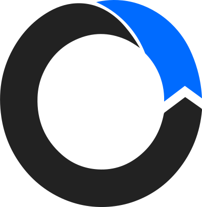
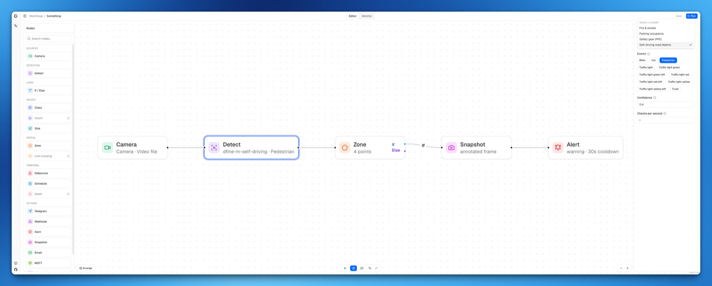
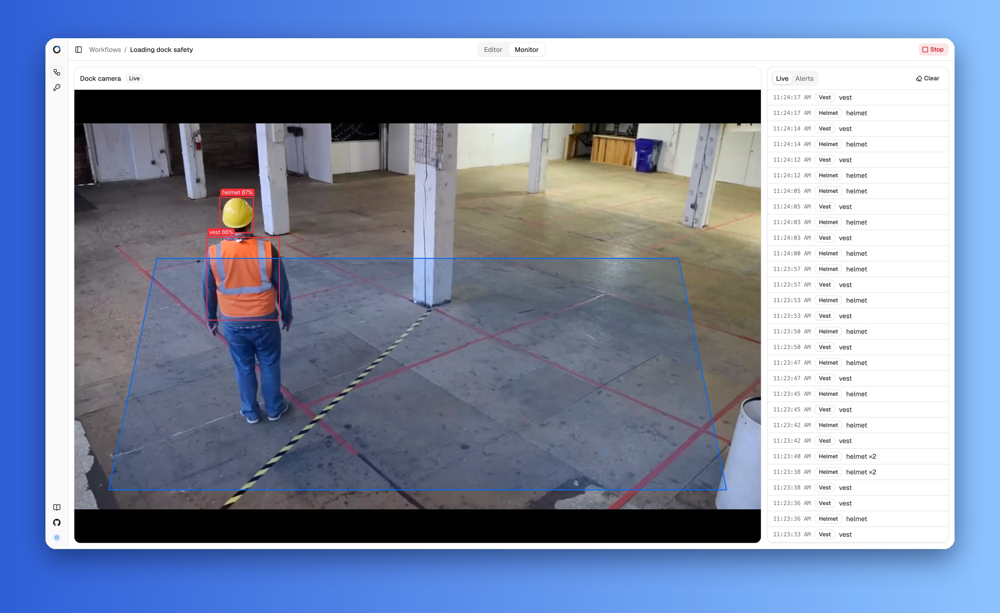
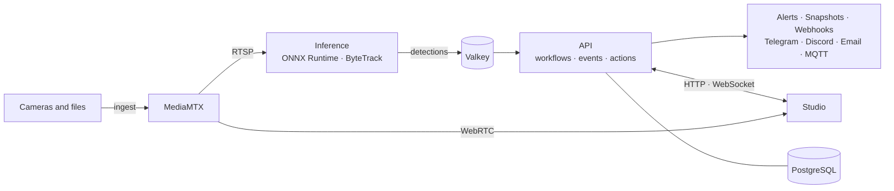

<p align="center">
  
</p>

<h1 align="center">LookSee</h1>

<p align="center">Self-hosted video analytics with a visual workflow editor.</p>

<p align="center">
  <a href="https://github.com/okoflow/looksee/actions/workflows/ci.yml"></a>
  <a href="https://github.com/okoflow/looksee/releases"></a>
  <a href="LICENSE"></a>
  <a href="https://github.com/okoflow/looksee-docs"></a>
</p>

LookSee watches live streams, browser webcams, and video files, runs ONNX object
detection on them, and turns what it sees into events. You describe what matters
as a workflow graph: a camera, a model, filters such as a zone or a schedule, and
actions such as an alert, a snapshot, or a Telegram message. Everything runs on
your own hardware.



## What it does

- **Any camera.** RTSP, RTMP, SRT, and WHEP streams, browser webcams published
  over WebRTC, and video files looped as live streams.
- **Your models.** Drop a model bundle into `models/`; detection runs on ONNX
  Runtime with CPU, CUDA, or CoreML providers and ByteTrack tracking.
- **Visual workflows.** Chain detection with class, zone, size, schedule,
  debounce, and if/else filters, then fan out to actions.
- **Actions that reach people.** Alerts with history, annotated snapshots,
  webhooks, Telegram, Discord, email, and MQTT. Slack, line crossing, dwell
  time, and counting are part of the Enterprise edition.
- **Live monitor.** Low-latency WebRTC playback with detection overlays, an
  event feed, and alert history next to every camera.
- **Self-hosted.** One `docker compose up`, PostgreSQL and Valkey for state,
  MediaMTX for streams, RustFS for video storage, no cloud dependency.



## How it works



The **API** owns workflows, cameras, credentials, and alerts, derives events
from detections, and walks the workflow graph for every event. The **inference
service** decodes streams, runs the model, tracks objects, and publishes strict
detection messages. **Studio** is the browser interface: the graph editor and
the live monitor. **MediaMTX** normalizes every source into one RTSP path per
camera and serves WebRTC playback to the browser.

## Quick start

You need Docker with Compose 2.24 or later.

```bash
git clone https://github.com/okoflow/looksee.git
cd looksee
cp .env.example .env
```

Set private `POSTGRES_PASSWORD`, `MTX_MEDIA_PASSWORD`, and `STORAGE_PASSWORD`
values in `.env`, then start the stack:

```bash
docker compose up -d --build
```

Open [http://127.0.0.1:3000](http://127.0.0.1:3000) and create the owner
account. RustFS stores uploaded videos in a persistent Docker volume; the
video bucket is created automatically. For a server on your network, set
`WEBRTC_HOST_IP` to its address.

> [!WARNING]
> Until the owner account exists, anyone who can reach the web interface can
> claim the instance. Run LookSee on a trusted network, and read
> [SECURITY.md](SECURITY.md) before exposing it further.

LookSee ships without detection models. A model is a directory under `models/`
with a `manifest.json` and a `model.onnx` exported from D-FINE; the API picks
it up on the next request. The documentation explains the bundle format and
how to export a model.

## Documentation

Guides and reference live in
[looksee-docs](https://github.com/okoflow/looksee-docs), available in English,
Russian, Hebrew, and Korean.

Start with *Getting started*, then *Concepts* for the workflow model and
*Nodes* for every node and its fields.

## Repository

| Path | What lives there |
| --- | --- |
| [`apps/api`](apps/api) | FastAPI control plane: workflows, cameras, events, actions, alerts |
| [`apps/inference`](apps/inference) | ONNX detection service: decoding, models, tracking |
| [`apps/studio`](apps/studio) | Next.js interface: workflow editor and live monitor |
| [`packages/shared`](packages/shared) | Pydantic wire contracts between the API and inference |
| [`ee/api`](ee/api) | Enterprise node types and integrations |
| `models` | Model bundles, discovered at runtime |
| `docker`, `compose.yaml` | MediaMTX configuration and the deployment stack |

[CONTRIBUTING.md](CONTRIBUTING.md) covers the development setup, the checks
that run in CI, and the commit and pull request conventions. Each package
README describes its internal layout.

## Editions

The Community edition is everything outside `ee/`, licensed under Apache-2.0.
The Enterprise edition adds line crossing, dwell time, and count threshold
filters and the Slack action; it is unlocked with `LICENSE_KEY` and licensed
under the [LookSee Enterprise license](ee/LICENSE). The same images ship both.

## Security

Report vulnerabilities privately through
[GitHub security advisories](https://github.com/okoflow/looksee/security/advisories/new).
[SECURITY.md](SECURITY.md) lists the supported versions, the process, and the
hardening steps for a deployment.

## License

Apache-2.0, except the `ee/` directory, which is under the
[LookSee Enterprise license](ee/LICENSE). See [LICENSE](LICENSE) and
[AUTHORS](AUTHORS).
